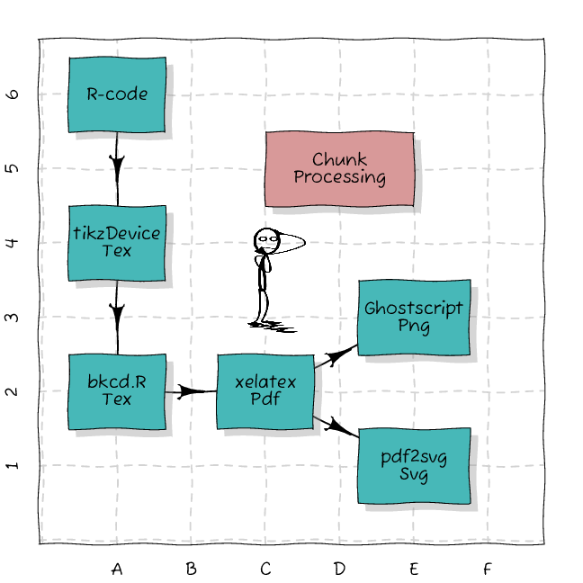
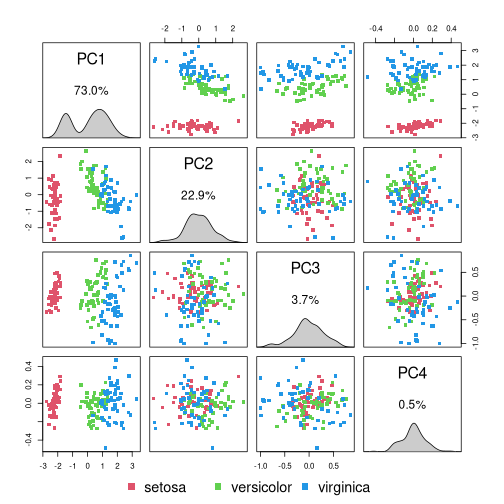

# Rcode

This is a repository with single file R-scripts and some R tutorials.

**Table of Contents**

* [bkcd.R](#bkcd)  - xkcd like plots using base graphicsfunctions and operators
* [sbi](#sbi)  - R functions for the course Statistical Bioinformatics

## Single file R-scripts
  

Installation of these scripts should be usually done by downloading the R-file
and placing it on a easy to remember place on your filesyste. I prefere to
place such scripts at *~/R/dlib*. That way I can write anywhere in myscripts
something like `source("~/R/dlib/filename.R")` to load the script.

### bkcd.R

`bkcd.R`  - xkcd like plots using base graphicsfunctions and operators

* Download: [bkcd.R](https://raw.githubusercontent.com/mittelmark/Rcode/main/bkcd/bkcd.R)
* Documentation: [bkcd.html](https://htmlpreview.github.io/?https://github.com/mittelmark/Rcode/blob/master/bkcd/bkcd.html)

Here an example, the internal workflow to create such plots written with script code from the R file itself:

This code is based on example code given on the tex-stackexchange see [here](https://tex.stackexchange.com/questions/74878/create-xkcd-style-diagram-in-tex).

### sbi.R

`sbi.R`  - R functions for the course Statistical Bioinformatics

* Download: [sbi.R](https://raw.githubusercontent.com/mittelmark/Rcode/main/sbi/sbi.R)
* Documentation: [sbi.html](https://htmlpreview.github.io/?https://github.com/mittelmark/Rcode/blob/master/sbi/sbi.html)

Here an example, a PCA pairs plot create with the function `sbi$pca.pairs`.

