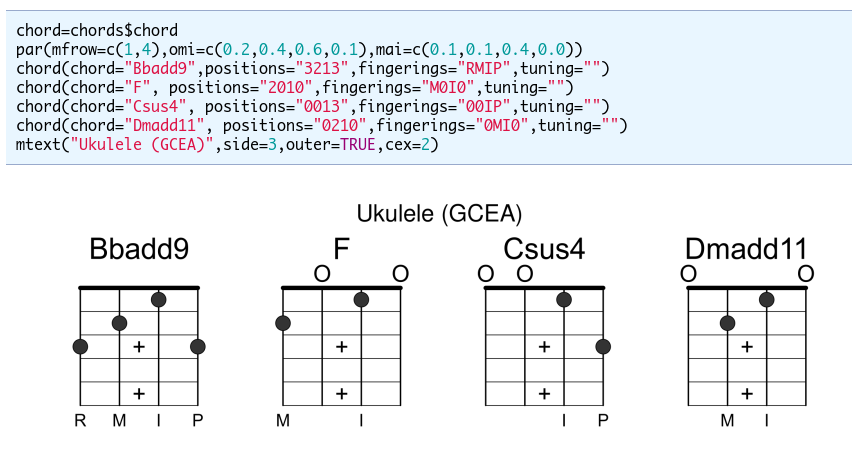

# Rcode

This is a repository with single file R-scripts and some R tutorials.

**Table of Contents**

* Single file R-scripts
    * [bkcd.R](#bkcd)  - xkcd like plots using base graphicsfunctions and operators
    * [chords.R](#chords) - draw chord diagrams for fretted instruments like Guitar and Ukulele using R
    * [sbi.R](#sbi)  - R functions for the course Statistical Bioinformatics
* Libraries
    * [mini](#mini) - a minimal R library which can be used as starter to build your own
* Tutorials
    * [venn.html](#venn) - programming a simple Venn diagram
    
## Single file R-scripts
  
Installation of these scripts should be usually done by downloading the R-file
and placing it on a easy to remember place on your filesyste. I prefere to
place such scripts at *~/R/dlib*. That way I can write anywhere in myscripts
something like `source("~/R/dlib/filename.R")` to load the script.


### bkcd.R
<a name="bkcd"> </a>

`bkcd.R`  - xkcd like plots using base graphics functions and operators (requires tikzDevice package and xelatex and ghostscript)

* Download: [bkcd.R](https://raw.githubusercontent.com/mittelmark/Rcode/main/bkcd/bkcd.R)
* Documentation: [bkcd.html](https://htmlpreview.github.io/?https://github.com/mittelmark/Rcode/blob/master/bkcd/bkcd.html)

Here an example, the internal workflow to create such plots written with script code from the R file itself:


### chords.R
<a name="chords"> </a>

`chords.R`  - draw chord diagrams for fretted instruments like Guitar and Ukulele using R

* Download: [chords.R](https://raw.githubusercontent.com/mittelmark/Rcode/main/chords/chords.R)
* Documentation: [chords.html](https://htmlpreview.github.io/?https://github.com/mittelmark/Rcode/blob/master/chords/chords.html)

Here an example, some non-standard chords for an Ukulele in the GCEA-tuning.




### sbi.R
<a name="sbi"> </a>

`sbi.R`  - R functions for the course Statistical Bioinformatics

* Download: [sbi.R](https://raw.githubusercontent.com/mittelmark/Rcode/main/sbi/sbi.R)
* Documentation: [sbi.html](https://htmlpreview.github.io/?https://github.com/mittelmark/Rcode/blob/master/sbi/sbi.html)

Here an example, a PCA pairs plot create with the function `sbi$pca.pairs`.


## Libraries

### mini

A minimal R library which can be used to start your own R library. No special packages are required.

* Download [mini_0.1.tar.gz](https://github.com/mittelmark/Rcode/raw/main/libs/mini_0.1.tar.gz)

You can use this library by unpacking and renaming the folder *mini* to your
new project name. Afterwards you have to edit the DESCRIPTION file to adapt
the project name. Let's assume that your project will be named *proj* you can
the build compile and check your package in the parent folder of the project
folder like this:

```
R CMD build proj
R CMD check proj_0.1.tar.gz
R CMD INSTALL proj_0.1.tar.gz
```

## R programming tutorials

The following links provide some programming tutorials to help students in
learning to program R and to create their own plots and graphics.

### Venn Diagrams
<a name="venn"> </a>

Venn diagrams are diagrams showing relations between sets. The following link provides a tutorial where 
a Venn diagram is build using just basic R plot commands on an empty plot surface. 

Here the link: [tutorials/venn-01.html](https://htmlpreview.github.io/?https://github.com/mittelmark/Rcode/blob/master/tutorials/venn-01.html)


## Links

Here a collection to interesting R projects, blogs etc.

* [r-bloggers.com](https://www.r-bloggers.com/)
* [box: Modules for R](https://github.com/klmr/box)
* [awesome R packages](https://github.com/qinwf/awesome-R)
* [rvest package](https://blog.rstudio.org/2014/11/24/rvest-easy-web-scraping-with-r/)
* [RSQLite](https://github.com/rstats-db/RSQLite)
* [openxlsx](https://github.com/awalker89/openxlsx)
* [munsell](https://github.com/cwickham/munsell)
* [latticeExtras](http://latticeextra.r-forge.r-project.org/)
* [igraph](http://igraph.org/)
* [randomForest](https://www.stat.berkeley.edu/~breiman/RandomForests/)
* [formatR](http://yihui.name/formatR/)
* [plumber](http://plumber.trestletech.com/)
* [Rcpp](http://www.rcpp.org/)
* [RcppArmadillo](https://github.com/RcppCore/RcppArmadillo)
* [diagram](https://cran.r-project.org/web/packages/diagram/index.html)
* [shape](https://cran.r-project.org/web/packages/shape/index.html)
* [extrafont](https://github.com/wch/extrafont)
